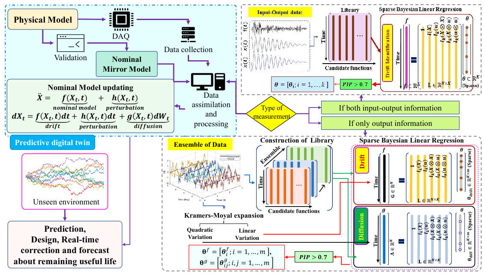

# Probabilistic-predictive-and-interpretable-digital-twin
This repository contains the python codes of the paper 
  > + Tripura, T., Desai, A. S., Adhikari, S., & Chakraborty, S. (2022). Probabilistic machine learning based predictive and interpretable digital twin for dynamical systems. arXiv preprint arXiv:2212.09240. [ArXiv](https://arxiv.org/abs/2212.09240)

# Schematic architecture of the proposed predictive digital twin framework for model updating of dynamical systems


# Files
  + `Deterministic_codes` Contains the source codes (examples 1-3) for DT, when both noisy input-output information are available.
  + `Stochastic_codes` Contains the source codes (examples 1-3) for DT, where model updating is performed using output-only measurements.

# BibTex
If you take help of our codes, please cite us at,
```
@article{tripura2022probabilistic,
  title={Probabilistic machine learning based predictive and interpretable digital twin for dynamical systems},
  author={Tripura, Tapas and Desai, Aarya Sheetal and Adhikari, Sondipon and Chakraborty, Souvik},
  journal={arXiv preprint arXiv:2212.09240},
  year={2022}
}
```
